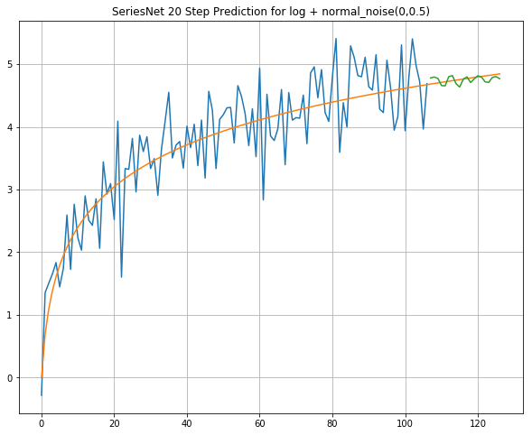
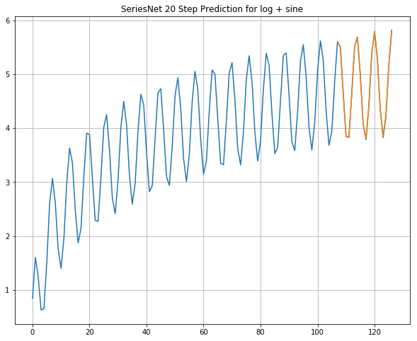

## SeriesNet 

### Time series prediction using dilated causal convolutional neural nets 

[In this paper](seriesnet-Krist-Papadopoulos-v1.pdf), state of the art deep learning techniques for time series forecasting were surveyed and a dilated causal convolutional neural network was developed (i.e. SeriesNet) based on the WaveNet architecture to forecast time series. It was found that SeriesNet without data preprocessing and ensemble methods achieved comparable results to top performing deep learning models on the international Computational Intelligence in Forecasting (CIF2016) competition dataset. This work extends previous work on using convolutional neural networks for time series forecasting.

 <b> Example of time series predictions with seriesnet</b>
 - First plot: log + normal noise - prediction for 20 steps in green
 - Second plot: log + sine - prediction for 20 steps in orange

### Requirements

- tested with tensorflow 2.6.5
- install requirements.txt
- train.py contains data preparation, model training and prediction functions
- toy example given in train.py to generate predictions and plot results
